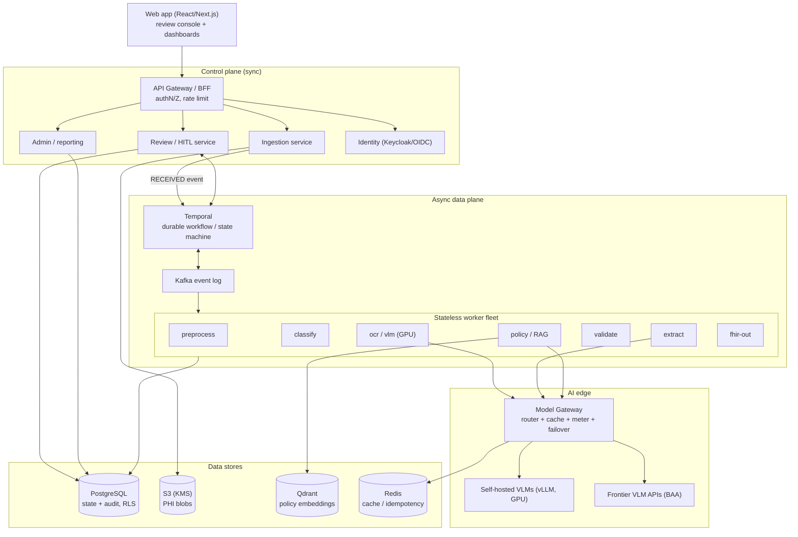

# C4 Level 2 — Container View

Shows the major deployable/logical building blocks inside Chartwright and how they interact. Rationale for each is in the planning package (`08-system-architecture.md`, `13-backend-architecture.md`).

**Key seams:** a thin synchronous control plane; a fat async data plane (Temporal + Kafka + workers); a Model Gateway that abstracts/meters all model calls; polyglot stores with DB-enforced tenancy.
