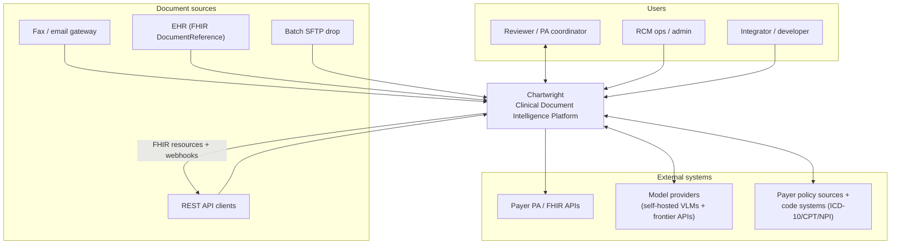

# C4 Level 1 — System Context

Shows Chartwright as a single system and the people and external systems it interacts with.

**Reading:** documents enter from multiple channels; reviewers and admins interact via the web app; the platform calls model providers and policy/code sources, and emits FHIR-aligned results to payers and integrators (aligned to CMS-0057-F).
