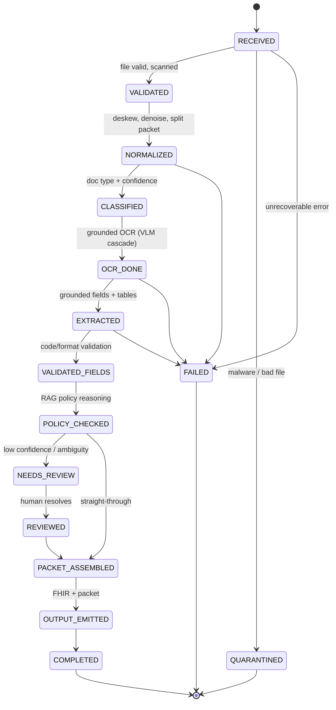

# Document Lifecycle — State Machine

The per-document workflow owned by the Temporal orchestration service (ADR-0001, ADR-0004). Every transition is an event persisted with a version + correlation ID; stages are idempotent and replayable.

**Notes:**
- `FAILED` messages land in a **dead-letter queue** with a structured reason and can be **replayed** deterministically after a fix or model upgrade.
- `NEEDS_REVIEW` is a **durable Temporal wait** (`request_human_input`) — the workflow pauses without polling until a reviewer acts.
- Confidence/policy thresholds (per tenant/field) decide the `NEEDS_REVIEW` vs. straight-through branch.
- Idempotency key for every transition: `document_id + stage + input_hash` → exactly-once *effects* under at-least-once delivery.
